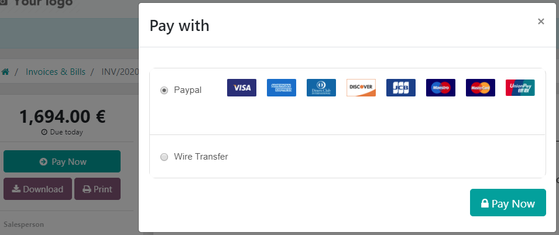
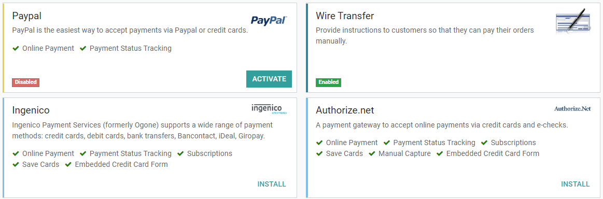

=================================================
Payment Acquirers (Credit Cards, Online Payments)
=================================================

Odoo embeds several **payment methods** that allow your customers to pay on their *Customer Portals*
or on your *eCommerce website*. They can pay Sales Orders, invoices or subscriptions with recurring
payments with their favourite payment acquirers, including **online payment providers** that accept
**Credit Cards**.

Having several payment methods increases the chances to get paid in time, or even immediately, as
you make it more convenient for your customers to pay with the payment method that they prefer and
trust.

.. important::
   Odoo does not keep any Credit Card information or credentials on its servers, nor is it stored on
   Odoo databases hosted elsewhere. Instead, Odoo apps use a unique reference to the data stored in
   the payment acquirers' systems, where the information is safely stored.

Payment Acquirers
=================

From an accounting perspective, we can distinguish two types of payment acquirers : the payments
that directly go on the bank account and follow the usual reconciliation workflow, and the payment
acquirers that are third-party services and require you to follow another accounting workflow.

- Bank Payments

  - | Wire Transfer
    | When selected, Odoo displays your payment information with a payment reference. You have to
      approve the payment manually once you have received it on your bank account.
  - | SEPA Direct Debit
    | Your customers can sign a SEPA Direct Debit mandate online and get their bank account charged
      Directly. :doc:`Click here <../../accounting/receivables/customer_payments/batch_sdd>` for
      more information about this payment method.

- Online Payment Providers

  - Adyen
  - AliPay
  - Authorize.net
  - Buckaroo
  - Ingenico
  - Paypal
  - PayU
  - PayUmoney
  - Sips
  - Stripe

Accounting perspective
----------------------

The **Bank Payments** that go directly to one of your bank accounts follow their usual
reconciliation workflows.

However, payments recorded with **Online Payment Providers** require you to configure a new
*Journal* and a new *Account*.

- Bank Journal

  - The Journal must be have a *Bank* type.
  - under the *Advanced Settings* tab, and make sure that **Posting** is set as *Post At Payment
    Validation*. This implies that the Journal Entry is recorded directly when your Odoo database
    receives the confirmation of the *Payment Authentication* from the Online Payment Provider.

- Current Asset Account

.. important::
   In many cases, Odoo automatically creates a new **Journal** and a new **Current Asset Account**
   when you activate a new Payment Acquirer. Both of them are preset to work out-of-the-box  but we
   recommend you to make sure these fields are correctly set according to your accounting needs and
   adapt them if necessary.

There are two ways to handle payments made with Payments Acquirers.

Undeposited Funds
-----------------

(mostly used in european countries):

The payment is recorded in a dedicated journal, on a dedicated account, when the *Payment Authentication* is confirmed.
This operation produces the following journal entry:

+----------------------+-------------------+----------+----------+
| Account              | Statement Match   | Debit    | Credit   |
+======================+===================+==========+==========+
| Account Receivable   |                   |          | 100.00   |
+----------------------+-------------------+----------+----------+
| Payment Acquirer     |                   | 100.00   |          |
+----------------------+-------------------+----------+----------+

At some point, the money is transferred from the *Payment Acquirer* to your *Bank Account*, and
you receive your bank statement.

Then, once you get the bank statements, you will match this statement
with the credit card that is in the 'Credit card' account.

+----------------+-------------------+----------+----------+
| Account        | Statement Match   | Debit    | Credit   |
+================+===================+==========+==========+
| Credit cards   | X                 |          | 100.00   |
+----------------+-------------------+----------+----------+
| Bank           |                   | 100.00   |          |
+----------------+-------------------+----------+----------+

   receive the credit card payment authorization, you record a
   payment by credit card on the invoice (using a Credit card
   journal and posted on the Undeposited Fund account). Then, once
   the credit card payments arrives in your bank account, move money
   from Undeposited Funds to your bank account.

Single Journal Entry
--------------------

** (mostly used in the U.S.):
   | once your
   receive the credit card payment, you record a payment on your
   bank, paid by credit card, without going through the Undeposited
   Funds. Once you process your bank statement, you do the matching
   with your bank feed and the credit card payment, without creating
   a dedicated journal entry .

We recommend the first approach as it is more accurate (your bank
account balance is accurate, taking into accounts credit cards that have
not been cashed yet). Both approaches require the same effort.

If you use eCommerce and an automated payment gateway, you will only
need to take care of the bank reconciliation part as paid invoice will
be automatically recorded in the right journal. You will use the second
approach.

Even if the first method is cleaner, Odoo support the second approach
because some accountants are used to it (*QuickBooks* and *Peachtree*
users).

If you use this approach to manage credit cards payments, you get the
list of credit cards payments that have not been cashed in the "Credit
card" account (accessible, for example, from the general ledger).

.. note::
   Both methods will produce the same data in your accounting at the end of the
   process. But, if you have credit cards that have not been cashed, this one
   is cleaner because those credit cards have not been reported yet on your bank
   account.

Option 2: One journal entry only
================================

From credit card payments to bank statements
--------------------------------------------

Once you receive a customer credit card payment, go to the related
invoice and click on Register Payment. Fill in the information about the
payment:

-  **Payment method**: the bank that will be used for the deposit

-  **Memo**: write the credit card transaction number

The invoice is marked as paid as soon as the credit card payment has
been recorded. Once you receive the bank statements, you will do the
matching with the statement and this actual payment (technically: point
this payment and relate it to the statement line).

With this approach, you will get the following journal entry in your
books:

+----------------------+-------------------+----------+----------+
| Account              | Statement Match   | Debit    | Credit   |
+======================+===================+==========+==========+
| Account Receivable   | X                 |          | 100.00   |
+----------------------+-------------------+----------+----------+
| Bank                 |                   | 100.00   |          |
+----------------------+-------------------+----------+----------+

.. tip::
   You may also record the payment directly without going on the customer
   invoice, using the top menu :menuselection:`Sales --> Payments`. This method may be more
   convenient if you have a lot of credit cards to record in a batch but you
   will have to reconcile entries afterwards (matching payments with invoices).

If you use this approach to manage received credit cards, you can use
the report "Bank Reconciliation Report" to verify which credit cards
have been received or paid by the bank (this report is available from
the "More" option from the Accounting dashboard on the related bank
account).

Configuration
=============

Add a new Payment Acquirer
--------------------------

To add a new Payment acquirer and make it available to your customers, go to
:menuselection:`Accounting --> Configuration --> Payment Acquirers`, look for your payment acquirer,
install the related module, and activate it. To do so, open the payment acquirer and change its
state from *Disabled* to *Enabled*.

.. warning::
   We recommend to use the *Test Mode* on a duplicated database or a test database. The Test Mode is
   meant to be used with your test / sandbox credentials, but Odoo generates Sales Orders and
   Invoices as usual. It isn't always possible to cancel an invoice, and this could create some
   issues with your invoices numbering if you were to test your payment acquirers on your main
   database.

Credentials
~~~~~~~~~~~

If not done yet, go to the **online payment provider**'s website, create an account and make sure to
have the credentials required for third-party use. You need these credentials to let Odoo
communicate with the Payment Acquirer and get the confirmation of the *payment authentication*.

The form in this section is specific to the Payment Acquirer you are configuring. Please refer to
the related documentation for more information.

Configuration
~~~~~~~~~~~~~

Save and reuse Credit Cards
***************************

The **Save Cards** feature is available for a few Payment Acquirers. If enabled, Odoo can store
**Payment Tokens** in your database, which can be used for subsequent payments, without having to
reenter the payment details. This is particularly useful for subscriptions' recurring payments.

Payment Tokens are available for the following payment acquirers:

- Authorize.net
- Ingenico
- Stripe

.. note::
   The payment tokens stored on the database don't hold information about the credit cards used.

Payment Journal
***************

The **Payment Journal** selected for your Payment Acquirer must be a *Bank* journal.

In the *Journal Entries* tab, make sure to select the right **Default Debit Account** and **Default
Credit Account**. The account you use should be dedicated to that Payment Acquirer, be configured
as a *Current Assets* account, and to *Allow Reconciliation*.

If you are configuring a Payment Acquirer for an *Online Payment Provider*, then go to the journal's
*Advanced Settings* tab, and make sure that the **Posting** is set as *Post At Payment Validation*.
This implies that the Journal Entry is recorded directly when your Odoo database receives the
confirmation of the *Payment Authentication* from the Online Payment Provider.

.. important::
   In many cases, Odoo automatically creates a new **Journal** and a new **Current Asset Account**
   when you activate a new Payment Acquirer. Both of them are preset to work out-of-the-box  but we
   recommend you to make sure these fields are correctly set according to your accounting needs and
   adapt them if necessary.

.. seealso::

   * :doc:`../../accounting/receivables/customer_payments/recording`